# TECH_TREE_VIEW.md（自動生成：tools/gen_tree_views.py。手で編集しない）

## 1. 状態ダッシュボード

| 幹 | 名前 | ✅ | 🔧 | ❓ | ⛔ | 計 | 進捗 |
|---|---|---|---|---|---|---|---|
| 0 | 生存・道具 | 19 | 0 | 0 | 0 | 19 | 100% |
| 1 | 冶金 | 29 | 0 | 47 | 0 | 76 | 38% |
| 2 | 化学 | 27 | 0 | 28 | 1 | 56 | 48% |
| 3 | 熱 | 7 | 0 | 15 | 0 | 22 | 31% |
| 4 | 動力・電気 | 11 | 0 | 22 | 0 | 33 | 33% |
| 5 | 真空 | 8 | 0 | 7 | 0 | 15 | 53% |
| 6 | ガス | 9 | 0 | 6 | 0 | 16 | 56% |
| 7 | 光学 | 13 | 0 | 12 | 0 | 25 | 52% |
| 8 | 精密・計測 | 9 | 0 | 33 | 0 | 42 | 21% |
| 9 | 半導体プロセス | 19 | 1 | 29 | 0 | 49 | 38% |
| 10 | 制御・計算 | 0 | 0 | 37 | 0 | 37 | 0% |
| 11 | 農業・食 | 0 | 0 | 17 | 0 | 17 | 0% |
| 12 | 建築・土木 | 1 | 0 | 16 | 0 | 17 | 5% |
| 13 | 医薬・衛生 | 0 | 0 | 15 | 0 | 15 | 0% |
| 14 | 輸送 | 0 | 0 | 20 | 0 | 20 | 0% |
| 15 | 通信・情報 | 1 | 0 | 30 | 0 | 31 | 3% |
| B | 枝 | 4 | 0 | 21 | 0 | 25 | 16% |
| 計 | | 157 | 1 | 355 | 1 | 515 | 30% |

**今すぐ作れる（前提が全部✅の❓）: 140 個**

- 幹1 冶金: [1-02] 自然銅、[1-04] 銅の製錬、[1-13] 亜鉛、[1-23] 輝水鉛鉱 MoS2、[1-25] モナザイト、[1-37] ニッケル、[1-39] マグネシウム、[1-43] アンチモン、[1-44] ガリウム、[1-47] 天然磁石、[1-48] 純酸素転炉、[1-49] 電炉製鋼、[1-50] 連続鋳造、[1-51] 圧延、[1-52] 押出し、[1-56] 蒸気ハンマー、[1-57] 炭素繊維、[1-58] 伸線、[1-59] パドル法、[1-60] 銅の電解精錬、[1-61] トーマス法、[1-63] マンガン添加、[1-64] 金の製錬、[1-66] タンタル、[1-67] 浮遊選鉱、[1-70] ジルコニウム・ハフニウム、[1-72] 粉末冶金と熱間静水圧プレス、[1-74] 超硬合金、[1-75] 真空脱ガス、[1-76] 直接還元製鉄
- 幹2 化学: [2-05] ルブラン法、[2-06] ソルベー法、[2-12] 硫酸塩、[2-15] ホウケイ酸ガラス、[2-22] 王水、[2-30] ネガ型フォトレジスト、[2-37] ポリエチレン、[2-38] PTFE、[2-43] ばん油、[2-44] 赤リン、[2-46] 透明な電極 ITO、[2-47] 化学強化ガラス、[2-51] ナイロン、[2-52] ボラン、[2-54] クロマトグラフィー、[2-56] ガラスの自動成形機
- 幹3 熱: [3-01] たき火、[3-05] 高炉、[3-07] るつぼ炉、[3-09] 熱電対、[3-11] 光高温計、[3-13] 断熱材、[3-19] 副産物回収式コークス炉、[3-20] 耐火粘土、[3-22] 蒸気圧縮の冷凍サイクル
- 幹4 動力・電気: [4-10] 変圧器、[4-11] 整流器、[4-16] アーク灯、[4-18] 電気のファン、[4-20] 振動モーター、[4-21] ブラシレス DC モーター、[4-25] 回生ブレーキ、[4-31] 原子力発電、[4-33] 水車タービン
- 幹5 真空: [5-03] 水銀柱と圧力の単位、[5-06] 油拡散ポンプ、[5-09] クライオポンプ → 液体窒素コールドトラップ、[5-12] 真空シール
- 幹6 ガス: [6-08] 希ガス精製、[6-09] ハーバー・ボッシュ法、[6-10] 硝石床、[6-12] 鉛室法硫酸、[6-14] フッ素ガス
- 幹7 光学: [7-24] カメラのオートフォーカス、[7-26] ホログラフィー
- 幹8 精密・計測: [8-06] 光波干渉測長、[8-12] 刻線機、[8-15] 水晶振動子、[8-19] 滑車、[8-21] 六分儀、[8-23] キログラム原器、[8-26] タイプライター、[8-27] 波動歯車減速機、[8-29] ローラーチェーン、[8-31] 研削盤、[8-32] 歯切り盤、[8-36] 傾斜パッド式スラスト軸受、[8-41] 水圧鍛造プレス、[8-42] 目盛り刻み機
- 幹9 半導体プロセス: [9-05] Geダイオード、[9-31] CMP
- 幹10 制御・計算: [10-01] 電磁石、[10-04] フィードバック制御、[10-07] 真空管フリップフロップと計算機、[10-20] 解析機関、[10-21] 計算尺
- 幹11 農業・食: [11-01] 灌漑、[11-02] 犂、[11-03] 輪作、[11-04] 品種改良、[11-05] 堆肥、[11-06] 過リン酸石灰、[11-08] 製粉、[11-10] 酒と酢、[11-11] 塩蔵・乾燥・燻製、[11-12] 缶詰、[11-13] 冷蔵・冷凍、[11-14] 砂糖
- 幹12 建築・土木: [12-01] ローマンコンクリート、[12-02] ポルトランドセメント、[12-04] 鉄骨構造、[12-05] 板ガラス、[12-06] 上水道、[12-09] 道路、[12-15] 避雷針
- 幹13 医薬・衛生: [13-01] 石けんと手洗い、[13-02] 消毒、[13-03] 麻酔、[13-04] 細菌学、[13-08] アスピリン、[13-09] サルファ剤、[13-13] 体温計、[13-14] フッ素と歯、[13-15] 医療用酸素
- 幹14 輸送: [14-01] 運河と閘門、[14-04] 蒸気船、[14-05] 鉄道、[14-07] 空気入りタイヤ、[14-09] 内燃機関、[14-14] 電気鉄道
- 幹15 通信・情報: [15-01] 紙、[15-05] 蓄音機、[15-09] 真空管ラジオ、[15-11] テレビ、[15-18] 静電容量式タッチパネル
- 幹B 枝: [B-04] マグネトロン・電子レンジ、[B-05] 偏光、[B-06] 偏光フィルム、[B-14] アセチレンランプ、[B-15] 豆腐

## 2. 背骨（石器→EUV→AI）

最短の鎖（[0-01] から [10-16] AI まで 7 ノード）

```mermaid
graph LR
  n0_01["0-01 打製石器 (2600000BC) ✅"]
  n0_02["0-02 火起こし (1000000BC) ✅"]
  n0_10["0-10 石灰焼成 (9000BC) ✅"]
  n7_14["7-14 CO2 レーザー (1964) ❓"]
  n7_18["7-18 EUV 光源 (2010) ❓"]
  n9_40["9-40 EUV 露光装置 (2019) ❓"]
  n10_16["10-16 ニューラルネット (1998) ❓"]
  n0_01-->n0_02
  n0_02-->n0_10
  n0_10-->n7_14
  n7_14-->n7_18
  n7_18-->n9_40
  n9_40-->n10_16
```

律速の鎖（[10-16] から最も深い前提をたどる、29 ノード）

```mermaid
graph LR
  n0_01["0-01 打製石器 (2600000BC) ✅"]
  n0_02["0-02 火起こし (1000000BC) ✅"]
  n0_03["0-03 土器 (20000BC) ✅"]
  n0_15["0-15 窯 (6000BC) ✅"]
  n1_06["1-06 塊鉄炉 (1200BC) ✅"]
  n1_09["1-09 高炉 (450BC) ✅"]
  n4_02["4-02 蒸気機関 (1776) ✅"]
  n1_26["1-26 鋼 (1856) ✅"]
  n8_01["8-01 旋盤 (1797) ✅"]
  n5_04["5-04 油回転ポンプ (1905) ✅"]
  n5_05["5-05 水銀拡散ポンプ (1915) ✅"]
  n5_02["5-02 真空管 (1904) ✅"]
  n4_09["4-09 高周波発振器 (1913) ✅"]
  n3_14["3-14 誘導加熱炉 (1916) ✅"]
  n9_07["9-07 Ge 単結晶の引き上げ (1950) ✅"]
  n9_08["9-08 CZ 法 (1951) ✅"]
  n9_12["9-12 ウェハー切断 (1954) ✅"]
  n9_16["9-16 熱拡散 (1954) ✅"]
  n9_18["9-18 プレーナ技術 (1959) ✅"]
  n9_22["9-22 集積回路 (1958) ✅"]
  n10_10["10-10 IC 論理 (1961) ❓"]
  n10_12["10-12 DRAM (1966) ❓"]
  n10_13["10-13 マイクロプロセッサ (1971) ❓"]
  n10_14["10-14 マイクロコンピュータ (1974) ❓"]
  n10_15["10-15 露光装置の制御 (1978) ❓"]
  n9_39["9-39 縮小投影露光 (1978) ❓"]
  n9_40["9-40 EUV 露光装置 (2019) ❓"]
  nB_11["B-11 AIチップ (2012) ❓"]
  n10_16["10-16 ニューラルネット (1998) ❓"]
  n0_01-->n0_02
  n0_02-->n0_03
  n0_03-->n0_15
  n0_15-->n1_06
  n1_06-->n1_09
  n1_09-->n4_02
  n4_02-->n1_26
  n1_26-->n8_01
  n8_01-->n5_04
  n5_04-->n5_05
  n5_05-->n5_02
  n5_02-->n4_09
  n4_09-->n3_14
  n3_14-->n9_07
  n9_07-->n9_08
  n9_08-->n9_12
  n9_12-->n9_16
  n9_16-->n9_18
  n9_18-->n9_22
  n9_22-->n10_10
  n10_10-->n10_12
  n10_12-->n10_13
  n10_13-->n10_14
  n10_14-->n10_15
  n10_15-->n9_39
  n9_39-->n9_40
  n9_40-->nB_11
  nB_11-->n10_16
```

## 3. 幹ごとの依存図（幹内の辺のみ。31ノード以上は次数の上位30）

### 幹0 生存・道具

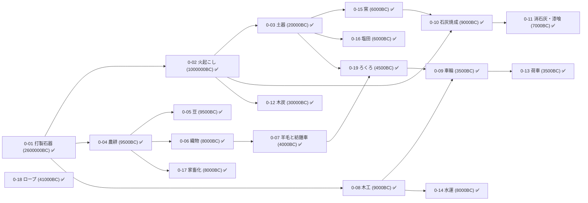
```mermaid
graph LR
  n0_01["0-01 打製石器 (2600000BC) ✅"]
  n0_02["0-02 火起こし (1000000BC) ✅"]
  n0_03["0-03 土器 (20000BC) ✅"]
  n0_04["0-04 農耕 (9500BC) ✅"]
  n0_05["0-05 豆 (9500BC) ✅"]
  n0_06["0-06 織物 (8000BC) ✅"]
  n0_07["0-07 羊毛と紡錘車 (4000BC) ✅"]
  n0_08["0-08 木工 (9000BC) ✅"]
  n0_09["0-09 車輪 (3500BC) ✅"]
  n0_10["0-10 石灰焼成 (9000BC) ✅"]
  n0_11["0-11 消石灰・漆喰 (7000BC) ✅"]
  n0_12["0-12 木炭 (30000BC) ✅"]
  n0_13["0-13 荷車 (3500BC) ✅"]
  n0_14["0-14 水運 (8000BC) ✅"]
  n0_15["0-15 窯 (6000BC) ✅"]
  n0_16["0-16 塩田 (6000BC) ✅"]
  n0_17["0-17 家畜化 (8000BC) ✅"]
  n0_18["0-18 ロープ (41000BC) ✅"]
  n0_19["0-19 ろくろ (4500BC) ✅"]
  n0_01-->n0_02
  n0_02-->n0_03
  n0_01-->n0_04
  n0_04-->n0_05
  n0_04-->n0_06
  n0_06-->n0_07
  n0_01-->n0_08
  n0_08-->n0_09
  n0_19-->n0_09
  n0_02-->n0_10
  n0_15-->n0_10
  n0_10-->n0_11
  n0_02-->n0_12
  n0_09-->n0_13
  n0_08-->n0_14
  n0_03-->n0_15
  n0_03-->n0_16
  n0_04-->n0_17
  n0_03-->n0_19
  n0_07-->n0_19
```

### 幹1 冶金

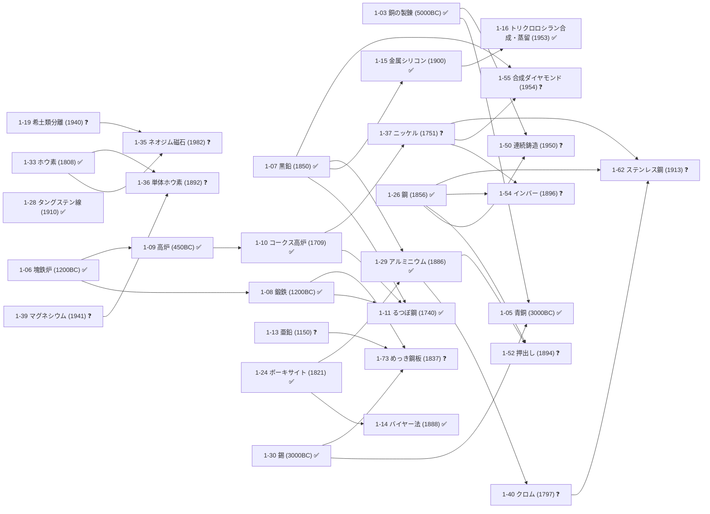
```mermaid
graph LR
  n1_03["1-03 銅の製錬 (5000BC) ✅"]
  n1_05["1-05 青銅 (3000BC) ✅"]
  n1_06["1-06 塊鉄炉 (1200BC) ✅"]
  n1_07["1-07 黒鉛 (1850) ✅"]
  n1_08["1-08 鍛鉄 (1200BC) ✅"]
  n1_09["1-09 高炉 (450BC) ✅"]
  n1_10["1-10 コークス高炉 (1709) ✅"]
  n1_11["1-11 るつぼ鋼 (1740) ✅"]
  n1_13["1-13 亜鉛 (1150) ❓"]
  n1_14["1-14 バイヤー法 (1888) ✅"]
  n1_15["1-15 金属シリコン (1900) ✅"]
  n1_16["1-16 トリクロロシラン合成・蒸留 (1953) ✅"]
  n1_19["1-19 希土類分離 (1940) ❓"]
  n1_24["1-24 ボーキサイト (1821) ✅"]
  n1_26["1-26 鋼 (1856) ✅"]
  n1_28["1-28 タングステン線 (1910) ✅"]
  n1_29["1-29 アルミニウム (1886) ✅"]
  n1_30["1-30 錫 (3000BC) ✅"]
  n1_33["1-33 ホウ素 (1808) ✅"]
  n1_35["1-35 ネオジム磁石 (1982) ❓"]
  n1_36["1-36 単体ホウ素 (1892) ❓"]
  n1_37["1-37 ニッケル (1751) ❓"]
  n1_39["1-39 マグネシウム (1941) ❓"]
  n1_40["1-40 クロム (1797) ❓"]
  n1_50["1-50 連続鋳造 (1950) ❓"]
  n1_52["1-52 押出し (1894) ❓"]
  n1_54["1-54 インバー (1896) ❓"]
  n1_55["1-55 合成ダイヤモンド (1954) ❓"]
  n1_62["1-62 ステンレス鋼 (1913) ❓"]
  n1_73["1-73 めっき鋼板 (1837) ❓"]
  n1_03-->n1_05
  n1_30-->n1_05
  n1_06-->n1_08
  n1_06-->n1_09
  n1_09-->n1_10
  n1_07-->n1_11
  n1_08-->n1_11
  n1_10-->n1_11
  n1_24-->n1_14
  n1_07-->n1_15
  n1_15-->n1_16
  n1_07-->n1_29
  n1_24-->n1_29
  n1_19-->n1_35
  n1_33-->n1_35
  n1_33-->n1_36
  n1_39-->n1_36
  n1_10-->n1_37
  n1_29-->n1_40
  n1_03-->n1_50
  n1_26-->n1_50
  n1_26-->n1_52
  n1_29-->n1_52
  n1_26-->n1_54
  n1_37-->n1_54
  n1_07-->n1_55
  n1_37-->n1_55
  n1_26-->n1_62
  n1_37-->n1_62
  n1_40-->n1_62
  n1_08-->n1_73
  n1_13-->n1_73
  n1_30-->n1_73
```

### 幹2 化学

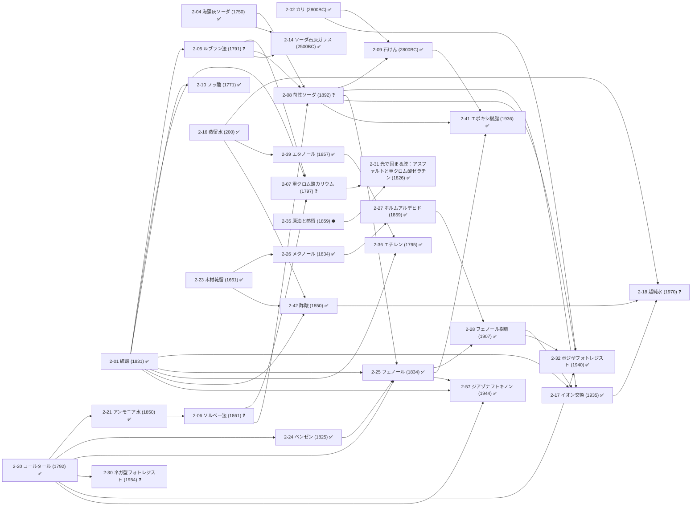
```mermaid
graph LR
  n2_01["2-01 硫酸 (1831) ✅"]
  n2_02["2-02 カリ (2800BC) ✅"]
  n2_04["2-04 海藻灰ソーダ (1750) ✅"]
  n2_05["2-05 ルブラン法 (1791) ❓"]
  n2_06["2-06 ソルベー法 (1861) ❓"]
  n2_07["2-07 重クロム酸カリウム (1797) ❓"]
  n2_08["2-08 苛性ソーダ (1892) ❓"]
  n2_09["2-09 石けん (2800BC) ✅"]
  n2_10["2-10 フッ酸 (1771) ✅"]
  n2_14["2-14 ソーダ石灰ガラス (2500BC) ✅"]
  n2_16["2-16 蒸留水 (200) ✅"]
  n2_17["2-17 イオン交換 (1935) ✅"]
  n2_18["2-18 超純水 (1970) ❓"]
  n2_20["2-20 コールタール (1792) ✅"]
  n2_21["2-21 アンモニア水 (1850) ✅"]
  n2_23["2-23 木材乾留 (1661) ✅"]
  n2_24["2-24 ベンゼン (1825) ✅"]
  n2_25["2-25 フェノール (1834) ✅"]
  n2_26["2-26 メタノール (1834) ✅"]
  n2_27["2-27 ホルムアルデヒド (1859) ✅"]
  n2_28["2-28 フェノール樹脂 (1907) ✅"]
  n2_30["2-30 ネガ型フォトレジスト (1954) ❓"]
  n2_31["2-31 光で固まる膜：アスファルトと重クロム酸ゼラチン (1826) ✅"]
  n2_32["2-32 ポジ型フォトレジスト (1940) ✅"]
  n2_35["2-35 原油と蒸留 (1859) ⛔"]
  n2_36["2-36 エチレン (1795) ✅"]
  n2_39["2-39 エタノール (1857) ✅"]
  n2_41["2-41 エポキシ樹脂 (1936) ✅"]
  n2_42["2-42 酢酸 (1850) ✅"]
  n2_57["2-57 ジアゾナフトキノン (1944) ✅"]
  n2_01-->n2_05
  n2_21-->n2_06
  n2_01-->n2_07
  n2_05-->n2_07
  n2_06-->n2_07
  n2_04-->n2_08
  n2_05-->n2_08
  n2_06-->n2_08
  n2_02-->n2_09
  n2_08-->n2_09
  n2_01-->n2_10
  n2_04-->n2_14
  n2_05-->n2_14
  n2_01-->n2_17
  n2_08-->n2_17
  n2_28-->n2_17
  n2_16-->n2_18
  n2_17-->n2_18
  n2_42-->n2_18
  n2_20-->n2_21
  n2_20-->n2_24
  n2_01-->n2_25
  n2_08-->n2_25
  n2_20-->n2_25
  n2_24-->n2_25
  n2_23-->n2_26
  n2_26-->n2_27
  n2_25-->n2_28
  n2_27-->n2_28
  n2_20-->n2_30
  n2_07-->n2_31
  n2_35-->n2_31
  n2_02-->n2_32
  n2_08-->n2_32
  n2_20-->n2_32
  n2_28-->n2_32
  n2_01-->n2_36
  n2_39-->n2_36
  n2_16-->n2_39
  n2_08-->n2_41
  n2_09-->n2_41
  n2_25-->n2_41
  n2_01-->n2_42
  n2_16-->n2_42
  n2_23-->n2_42
  n2_01-->n2_57
  n2_20-->n2_57
  n2_25-->n2_57
```

### 幹3 熱

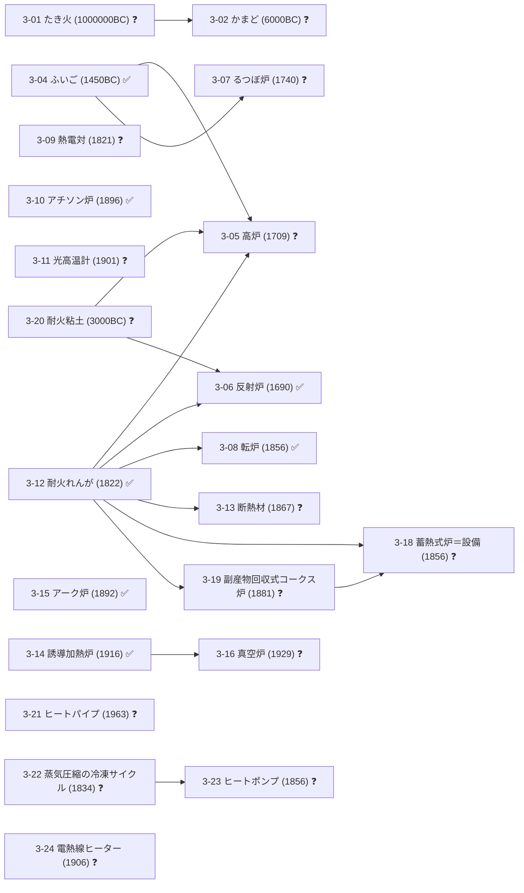
```mermaid
graph LR
  n3_01["3-01 たき火 (1000000BC) ❓"]
  n3_02["3-02 かまど (6000BC) ❓"]
  n3_04["3-04 ふいご (1450BC) ✅"]
  n3_05["3-05 高炉 (1709) ❓"]
  n3_06["3-06 反射炉 (1690) ✅"]
  n3_07["3-07 るつぼ炉 (1740) ❓"]
  n3_08["3-08 転炉 (1856) ✅"]
  n3_09["3-09 熱電対 (1821) ❓"]
  n3_10["3-10 アチソン炉 (1896) ✅"]
  n3_11["3-11 光高温計 (1901) ❓"]
  n3_12["3-12 耐火れんが (1822) ✅"]
  n3_13["3-13 断熱材 (1867) ❓"]
  n3_14["3-14 誘導加熱炉 (1916) ✅"]
  n3_15["3-15 アーク炉 (1892) ✅"]
  n3_16["3-16 真空炉 (1929) ❓"]
  n3_18["3-18 蓄熱式炉＝設備 (1856) ❓"]
  n3_19["3-19 副産物回収式コークス炉 (1881) ❓"]
  n3_20["3-20 耐火粘土 (3000BC) ❓"]
  n3_21["3-21 ヒートパイプ (1963) ❓"]
  n3_22["3-22 蒸気圧縮の冷凍サイクル (1834) ❓"]
  n3_23["3-23 ヒートポンプ (1856) ❓"]
  n3_24["3-24 電熱線ヒーター (1906) ❓"]
  n3_01-->n3_02
  n3_04-->n3_05
  n3_12-->n3_05
  n3_20-->n3_05
  n3_12-->n3_06
  n3_20-->n3_06
  n3_04-->n3_07
  n3_12-->n3_08
  n3_12-->n3_13
  n3_14-->n3_16
  n3_12-->n3_18
  n3_19-->n3_18
  n3_12-->n3_19
  n3_22-->n3_23
```

### 幹4 動力・電気

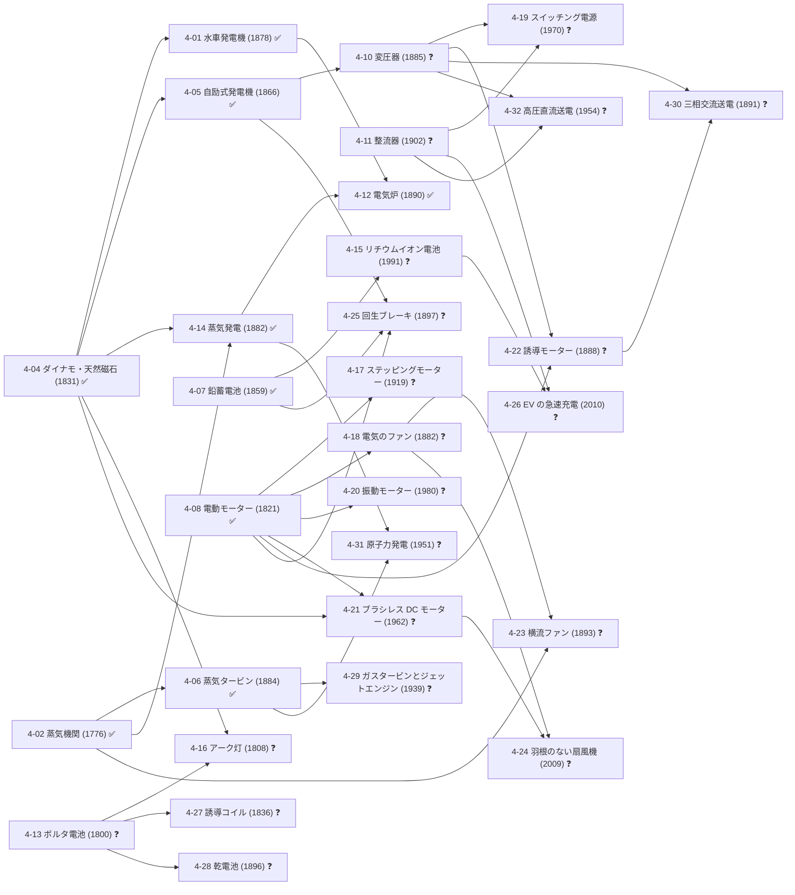
```mermaid
graph LR
  n4_01["4-01 水車発電機 (1878) ✅"]
  n4_02["4-02 蒸気機関 (1776) ✅"]
  n4_04["4-04 ダイナモ・天然磁石 (1831) ✅"]
  n4_05["4-05 自励式発電機 (1866) ✅"]
  n4_06["4-06 蒸気タービン (1884) ✅"]
  n4_07["4-07 鉛蓄電池 (1859) ✅"]
  n4_08["4-08 電動モーター (1821) ✅"]
  n4_10["4-10 変圧器 (1885) ❓"]
  n4_11["4-11 整流器 (1902) ❓"]
  n4_12["4-12 電気炉 (1890) ✅"]
  n4_13["4-13 ボルタ電池 (1800) ❓"]
  n4_14["4-14 蒸気発電 (1882) ✅"]
  n4_15["4-15 リチウムイオン電池 (1991) ❓"]
  n4_16["4-16 アーク灯 (1808) ❓"]
  n4_17["4-17 ステッピングモーター (1919) ❓"]
  n4_18["4-18 電気のファン (1882) ❓"]
  n4_19["4-19 スイッチング電源 (1970) ❓"]
  n4_20["4-20 振動モーター (1980) ❓"]
  n4_21["4-21 ブラシレス DC モーター (1962) ❓"]
  n4_22["4-22 誘導モーター (1888) ❓"]
  n4_23["4-23 横流ファン (1893) ❓"]
  n4_24["4-24 羽根のない扇風機 (2009) ❓"]
  n4_25["4-25 回生ブレーキ (1897) ❓"]
  n4_26["4-26 EV の急速充電 (2010) ❓"]
  n4_27["4-27 誘導コイル (1836) ❓"]
  n4_28["4-28 乾電池 (1896) ❓"]
  n4_29["4-29 ガスタービンとジェットエンジン (1939) ❓"]
  n4_30["4-30 三相交流送電 (1891) ❓"]
  n4_31["4-31 原子力発電 (1951) ❓"]
  n4_32["4-32 高圧直流送電 (1954) ❓"]
  n4_04-->n4_01
  n4_04-->n4_05
  n4_02-->n4_06
  n4_05-->n4_10
  n4_01-->n4_12
  n4_14-->n4_12
  n4_02-->n4_14
  n4_04-->n4_14
  n4_07-->n4_15
  n4_04-->n4_16
  n4_13-->n4_16
  n4_08-->n4_17
  n4_08-->n4_18
  n4_10-->n4_19
  n4_11-->n4_19
  n4_08-->n4_20
  n4_04-->n4_21
  n4_08-->n4_21
  n4_08-->n4_22
  n4_10-->n4_22
  n4_02-->n4_23
  n4_18-->n4_23
  n4_18-->n4_24
  n4_21-->n4_24
  n4_05-->n4_25
  n4_07-->n4_25
  n4_08-->n4_25
  n4_11-->n4_26
  n4_15-->n4_26
  n4_13-->n4_27
  n4_13-->n4_28
  n4_06-->n4_29
  n4_10-->n4_30
  n4_22-->n4_30
  n4_06-->n4_31
  n4_14-->n4_31
  n4_10-->n4_32
  n4_11-->n4_32
```

### 幹5 真空

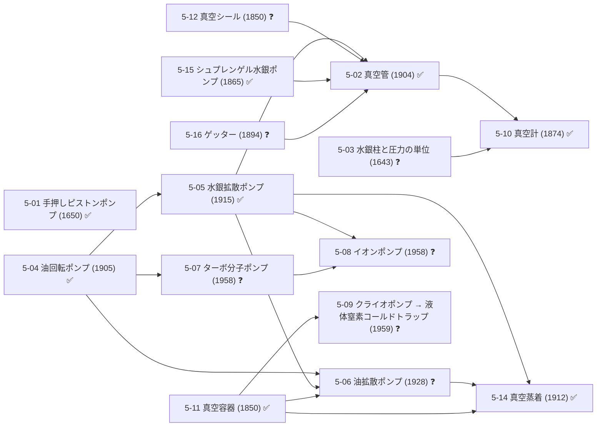
```mermaid
graph LR
  n5_01["5-01 手押しピストンポンプ (1650) ✅"]
  n5_02["5-02 真空管 (1904) ✅"]
  n5_03["5-03 水銀柱と圧力の単位 (1643) ❓"]
  n5_04["5-04 油回転ポンプ (1905) ✅"]
  n5_05["5-05 水銀拡散ポンプ (1915) ✅"]
  n5_06["5-06 油拡散ポンプ (1928) ❓"]
  n5_07["5-07 ターボ分子ポンプ (1958) ❓"]
  n5_08["5-08 イオンポンプ (1958) ❓"]
  n5_09["5-09 クライオポンプ → 液体窒素コールドトラップ (1959) ❓"]
  n5_10["5-10 真空計 (1874) ✅"]
  n5_11["5-11 真空容器 (1850) ✅"]
  n5_12["5-12 真空シール (1850) ❓"]
  n5_14["5-14 真空蒸着 (1912) ✅"]
  n5_15["5-15 シュプレンゲル水銀ポンプ (1865) ✅"]
  n5_16["5-16 ゲッター (1894) ❓"]
  n5_05-->n5_02
  n5_12-->n5_02
  n5_15-->n5_02
  n5_16-->n5_02
  n5_04-->n5_05
  n5_04-->n5_06
  n5_05-->n5_06
  n5_11-->n5_06
  n5_04-->n5_07
  n5_05-->n5_08
  n5_07-->n5_08
  n5_11-->n5_09
  n5_02-->n5_10
  n5_03-->n5_10
  n5_05-->n5_14
  n5_06-->n5_14
  n5_11-->n5_14
```

### 幹6 ガス

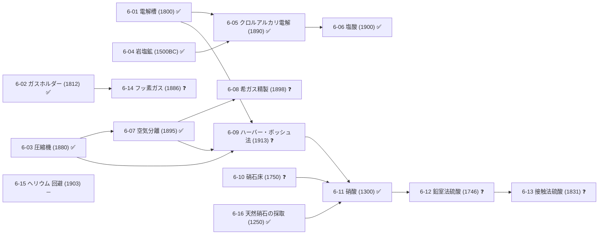
```mermaid
graph LR
  n6_01["6-01 電解槽 (1800) ✅"]
  n6_02["6-02 ガスホルダー (1812) ✅"]
  n6_03["6-03 圧縮機 (1880) ✅"]
  n6_04["6-04 岩塩鉱 (1500BC) ✅"]
  n6_05["6-05 クロルアルカリ電解 (1890) ✅"]
  n6_06["6-06 塩酸 (1900) ✅"]
  n6_07["6-07 空気分離 (1895) ✅"]
  n6_08["6-08 希ガス精製 (1898) ❓"]
  n6_09["6-09 ハーバー・ボッシュ法 (1913) ❓"]
  n6_10["6-10 硝石床 (1750) ❓"]
  n6_11["6-11 硝酸 (1300) ✅"]
  n6_12["6-12 鉛室法硫酸 (1746) ❓"]
  n6_13["6-13 接触法硫酸 (1831) ❓"]
  n6_14["6-14 フッ素ガス (1886) ❓"]
  n6_15["6-15 ヘリウム 回避 (1903) ➖"]
  n6_16["6-16 天然硝石の採取 (1250) ✅"]
  n6_01-->n6_05
  n6_04-->n6_05
  n6_05-->n6_06
  n6_03-->n6_07
  n6_07-->n6_08
  n6_01-->n6_09
  n6_03-->n6_09
  n6_07-->n6_09
  n6_09-->n6_11
  n6_10-->n6_11
  n6_16-->n6_11
  n6_11-->n6_12
  n6_12-->n6_13
  n6_02-->n6_14
```

### 幹7 光学

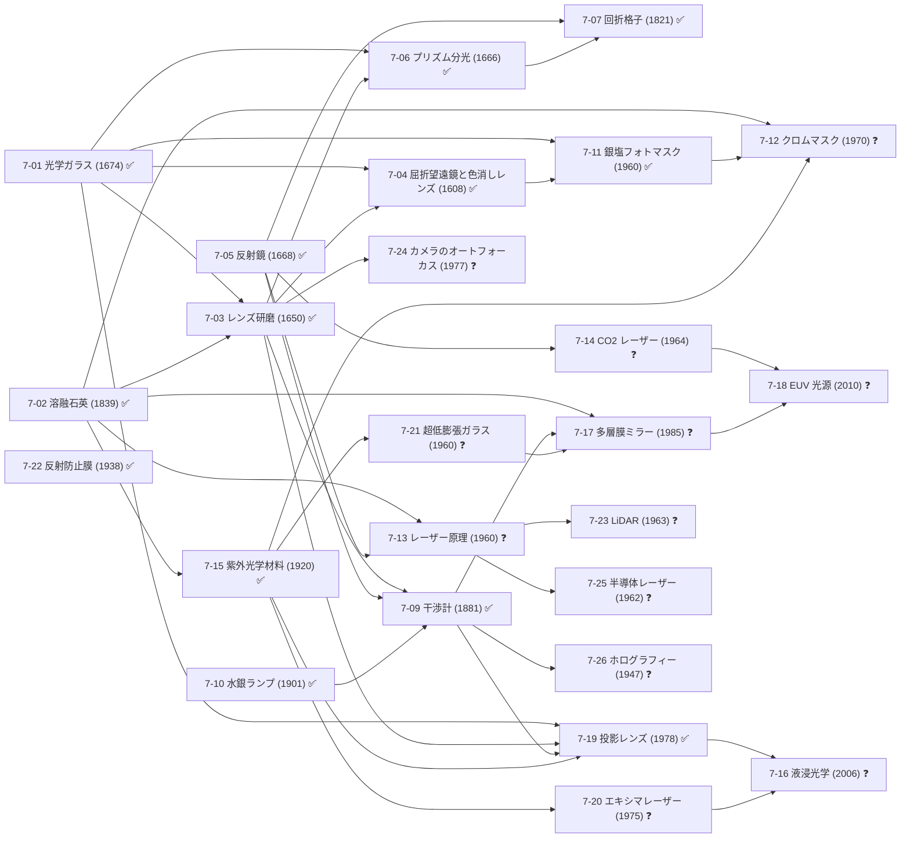
```mermaid
graph LR
  n7_01["7-01 光学ガラス (1674) ✅"]
  n7_02["7-02 溶融石英 (1839) ✅"]
  n7_03["7-03 レンズ研磨 (1650) ✅"]
  n7_04["7-04 屈折望遠鏡と色消しレンズ (1608) ✅"]
  n7_05["7-05 反射鏡 (1668) ✅"]
  n7_06["7-06 プリズム分光 (1666) ✅"]
  n7_07["7-07 回折格子 (1821) ✅"]
  n7_09["7-09 干渉計 (1881) ✅"]
  n7_10["7-10 水銀ランプ (1901) ✅"]
  n7_11["7-11 銀塩フォトマスク (1960) ✅"]
  n7_12["7-12 クロムマスク (1970) ❓"]
  n7_13["7-13 レーザー原理 (1960) ❓"]
  n7_14["7-14 CO2 レーザー (1964) ❓"]
  n7_15["7-15 紫外光学材料 (1920) ✅"]
  n7_16["7-16 液浸光学 (2006) ❓"]
  n7_17["7-17 多層膜ミラー (1985) ❓"]
  n7_18["7-18 EUV 光源 (2010) ❓"]
  n7_19["7-19 投影レンズ (1978) ✅"]
  n7_20["7-20 エキシマレーザー (1975) ❓"]
  n7_21["7-21 超低膨張ガラス (1960) ❓"]
  n7_22["7-22 反射防止膜 (1938) ✅"]
  n7_23["7-23 LiDAR (1963) ❓"]
  n7_24["7-24 カメラのオートフォーカス (1977) ❓"]
  n7_25["7-25 半導体レーザー (1962) ❓"]
  n7_26["7-26 ホログラフィー (1947) ❓"]
  n7_01-->n7_03
  n7_02-->n7_03
  n7_01-->n7_04
  n7_03-->n7_04
  n7_01-->n7_06
  n7_03-->n7_06
  n7_05-->n7_07
  n7_06-->n7_07
  n7_03-->n7_09
  n7_05-->n7_09
  n7_10-->n7_09
  n7_01-->n7_11
  n7_04-->n7_11
  n7_02-->n7_12
  n7_11-->n7_12
  n7_15-->n7_12
  n7_02-->n7_13
  n7_05-->n7_13
  n7_05-->n7_14
  n7_02-->n7_15
  n7_19-->n7_16
  n7_20-->n7_16
  n7_02-->n7_17
  n7_09-->n7_17
  n7_21-->n7_17
  n7_14-->n7_18
  n7_17-->n7_18
  n7_01-->n7_19
  n7_03-->n7_19
  n7_09-->n7_19
  n7_15-->n7_19
  n7_15-->n7_20
  n7_15-->n7_21
  n7_13-->n7_23
  n7_03-->n7_24
  n7_13-->n7_25
  n7_09-->n7_26
```

### 幹8 精密・計測

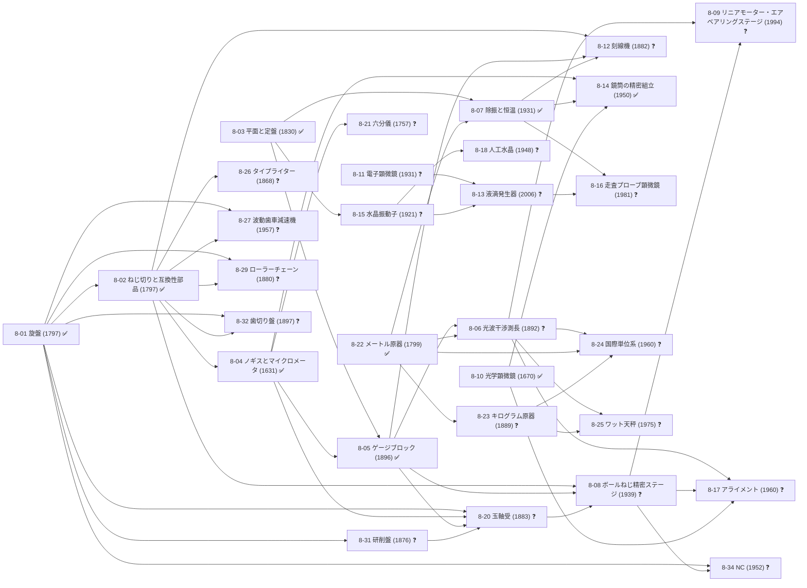
```mermaid
graph LR
  n8_01["8-01 旋盤 (1797) ✅"]
  n8_02["8-02 ねじ切りと互換性部品 (1797) ✅"]
  n8_03["8-03 平面と定盤 (1830) ✅"]
  n8_04["8-04 ノギスとマイクロメータ (1631) ✅"]
  n8_05["8-05 ゲージブロック (1896) ✅"]
  n8_06["8-06 光波干渉測長 (1892) ❓"]
  n8_07["8-07 除振と恒温 (1931) ✅"]
  n8_08["8-08 ボールねじ精密ステージ (1939) ❓"]
  n8_09["8-09 リニアモーター・エアベアリングステージ (1994) ❓"]
  n8_10["8-10 光学顕微鏡 (1670) ✅"]
  n8_11["8-11 電子顕微鏡 (1931) ❓"]
  n8_12["8-12 刻線機 (1882) ❓"]
  n8_13["8-13 液滴発生器 (2006) ❓"]
  n8_14["8-14 鏡筒の精密組立 (1950) ✅"]
  n8_15["8-15 水晶振動子 (1921) ❓"]
  n8_16["8-16 走査プローブ顕微鏡 (1981) ❓"]
  n8_17["8-17 アライメント (1960) ❓"]
  n8_18["8-18 人工水晶 (1948) ❓"]
  n8_20["8-20 玉軸受 (1883) ❓"]
  n8_21["8-21 六分儀 (1757) ❓"]
  n8_22["8-22 メートル原器 (1799) ✅"]
  n8_23["8-23 キログラム原器 (1889) ❓"]
  n8_24["8-24 国際単位系 (1960) ❓"]
  n8_25["8-25 ワット天秤 (1975) ❓"]
  n8_26["8-26 タイプライター (1868) ❓"]
  n8_27["8-27 波動歯車減速機 (1957) ❓"]
  n8_29["8-29 ローラーチェーン (1880) ❓"]
  n8_31["8-31 研削盤 (1876) ❓"]
  n8_32["8-32 歯切り盤 (1897) ❓"]
  n8_34["8-34 NC (1952) ❓"]
  n8_01-->n8_02
  n8_02-->n8_04
  n8_03-->n8_05
  n8_04-->n8_05
  n8_05-->n8_06
  n8_22-->n8_06
  n8_03-->n8_07
  n8_22-->n8_07
  n8_02-->n8_08
  n8_05-->n8_08
  n8_20-->n8_08
  n8_06-->n8_09
  n8_08-->n8_09
  n8_02-->n8_12
  n8_05-->n8_12
  n8_07-->n8_12
  n8_11-->n8_13
  n8_15-->n8_13
  n8_04-->n8_14
  n8_07-->n8_14
  n8_10-->n8_14
  n8_03-->n8_15
  n8_07-->n8_16
  n8_13-->n8_16
  n8_06-->n8_17
  n8_08-->n8_17
  n8_10-->n8_17
  n8_15-->n8_18
  n8_01-->n8_20
  n8_04-->n8_20
  n8_05-->n8_20
  n8_31-->n8_20
  n8_04-->n8_21
  n8_22-->n8_23
  n8_06-->n8_24
  n8_22-->n8_24
  n8_23-->n8_24
  n8_06-->n8_25
  n8_23-->n8_25
  n8_02-->n8_26
  n8_01-->n8_27
  n8_02-->n8_27
  n8_01-->n8_29
  n8_02-->n8_29
  n8_01-->n8_31
  n8_01-->n8_32
  n8_02-->n8_32
  n8_01-->n8_34
  n8_08-->n8_34
```

### 幹9 半導体プロセス

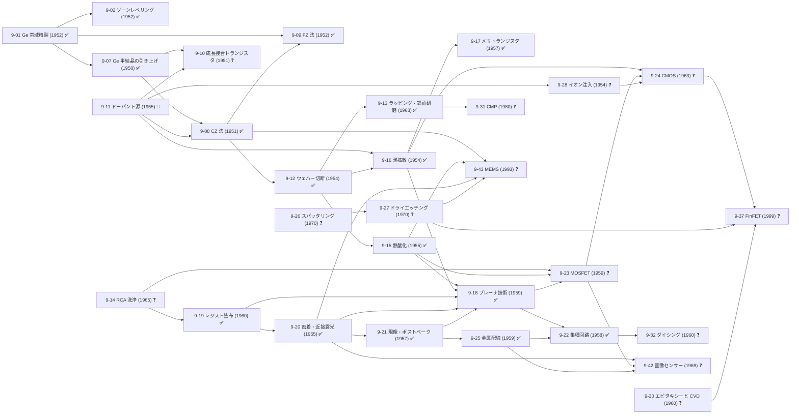
```mermaid
graph LR
  n9_01["9-01 Ge 帯域精製 (1952) ✅"]
  n9_02["9-02 ゾーンレベリング (1952) ✅"]
  n9_07["9-07 Ge 単結晶の引き上げ (1950) ✅"]
  n9_08["9-08 CZ 法 (1951) ✅"]
  n9_09["9-09 FZ 法 (1952) ✅"]
  n9_10["9-10 成長接合トランジスタ (1951) ❓"]
  n9_11["9-11 ドーパント源 (1955) 🔧"]
  n9_12["9-12 ウェハー切断 (1954) ✅"]
  n9_13["9-13 ラッピング・鏡面研磨 (1963) ✅"]
  n9_14["9-14 RCA 洗浄 (1965) ❓"]
  n9_15["9-15 熱酸化 (1955) ✅"]
  n9_16["9-16 熱拡散 (1954) ✅"]
  n9_17["9-17 メサトランジスタ (1957) ✅"]
  n9_18["9-18 プレーナ技術 (1959) ✅"]
  n9_19["9-19 レジスト塗布 (1960) ✅"]
  n9_20["9-20 密着・近接露光 (1955) ✅"]
  n9_21["9-21 現像・ポストベーク (1957) ✅"]
  n9_22["9-22 集積回路 (1958) ✅"]
  n9_23["9-23 MOSFET (1959) ❓"]
  n9_24["9-24 CMOS (1963) ❓"]
  n9_25["9-25 金属配線 (1959) ✅"]
  n9_26["9-26 スパッタリング (1970) ❓"]
  n9_27["9-27 ドライエッチング (1970) ❓"]
  n9_28["9-28 イオン注入 (1954) ❓"]
  n9_30["9-30 エピタキシーと CVD (1960) ❓"]
  n9_31["9-31 CMP (1980) ❓"]
  n9_32["9-32 ダイシング (1960) ❓"]
  n9_37["9-37 FinFET (1999) ❓"]
  n9_42["9-42 画像センサー (1969) ❓"]
  n9_43["9-43 MEMS (1993) ❓"]
  n9_01-->n9_02
  n9_01-->n9_07
  n9_07-->n9_08
  n9_11-->n9_08
  n9_01-->n9_09
  n9_08-->n9_09
  n9_07-->n9_10
  n9_11-->n9_10
  n9_08-->n9_12
  n9_12-->n9_13
  n9_12-->n9_15
  n9_11-->n9_16
  n9_12-->n9_16
  n9_16-->n9_17
  n9_15-->n9_18
  n9_16-->n9_18
  n9_19-->n9_18
  n9_20-->n9_18
  n9_21-->n9_18
  n9_14-->n9_19
  n9_19-->n9_20
  n9_20-->n9_21
  n9_18-->n9_22
  n9_25-->n9_22
  n9_14-->n9_23
  n9_15-->n9_23
  n9_18-->n9_23
  n9_16-->n9_24
  n9_23-->n9_24
  n9_28-->n9_24
  n9_21-->n9_25
  n9_26-->n9_27
  n9_11-->n9_28
  n9_13-->n9_31
  n9_22-->n9_32
  n9_24-->n9_37
  n9_27-->n9_37
  n9_30-->n9_37
  n9_20-->n9_42
  n9_23-->n9_42
  n9_25-->n9_42
  n9_08-->n9_43
  n9_15-->n9_43
  n9_20-->n9_43
  n9_27-->n9_43
```

### 幹10 制御・計算

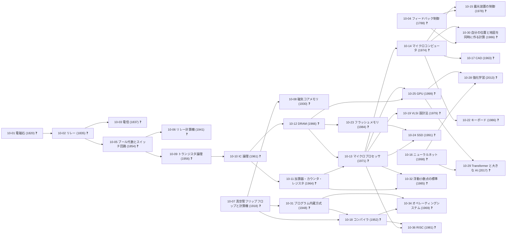
```mermaid
graph LR
  n10_01["10-01 電磁石 (1820) ❓"]
  n10_02["10-02 リレー (1835) ❓"]
  n10_03["10-03 電信 (1837) ❓"]
  n10_04["10-04 フィードバック制御 (1788) ❓"]
  n10_05["10-05 ブール代数とスイッチ回路 (1854) ❓"]
  n10_06["10-06 リレー計算機 (1941) ❓"]
  n10_07["10-07 真空管フリップフロップと計算機 (1918) ❓"]
  n10_08["10-08 磁気コアメモリ (1930) ❓"]
  n10_09["10-09 トランジスタ論理 (1956) ❓"]
  n10_10["10-10 IC 論理 (1961) ❓"]
  n10_11["10-11 加算器・カウンタ・レジスタ (1964) ❓"]
  n10_12["10-12 DRAM (1966) ❓"]
  n10_13["10-13 マイクロプロセッサ (1971) ❓"]
  n10_14["10-14 マイクロコンピュータ (1974) ❓"]
  n10_15["10-15 露光装置の制御 (1978) ❓"]
  n10_16["10-16 ニューラルネット (1998) ❓"]
  n10_17["10-17 CAD (1963) ❓"]
  n10_18["10-18 コンパイラ (1952) ❓"]
  n10_19["10-19 VLSI 設計法 (1979) ❓"]
  n10_22["10-22 キーボード (1986) ❓"]
  n10_23["10-23 フラッシュメモリ (1984) ❓"]
  n10_24["10-24 SSD (1991) ❓"]
  n10_25["10-25 GPU (1999) ❓"]
  n10_28["10-28 強化学習 (2013) ❓"]
  n10_29["10-29 Transformer と大きな AI (2017) ❓"]
  n10_30["10-30 自分の位置と地図を同時に作る計算 (1986) ❓"]
  n10_31["10-31 プログラム内蔵方式 (1948) ❓"]
  n10_32["10-32 浮動小数点の標準 (1985) ❓"]
  n10_34["10-34 オペレーティングシステム (1969) ❓"]
  n10_36["10-36 RISC (1981) ❓"]
  n10_01-->n10_02
  n10_02-->n10_03
  n10_02-->n10_05
  n10_05-->n10_06
  n10_07-->n10_08
  n10_05-->n10_09
  n10_09-->n10_10
  n10_10-->n10_11
  n10_10-->n10_12
  n10_11-->n10_13
  n10_12-->n10_13
  n10_13-->n10_14
  n10_04-->n10_15
  n10_14-->n10_15
  n10_14-->n10_17
  n10_07-->n10_18
  n10_31-->n10_18
  n10_13-->n10_19
  n10_14-->n10_22
  n10_12-->n10_23
  n10_13-->n10_24
  n10_23-->n10_24
  n10_12-->n10_25
  n10_13-->n10_25
  n10_16-->n10_28
  n10_25-->n10_28
  n10_16-->n10_29
  n10_25-->n10_29
  n10_04-->n10_30
  n10_14-->n10_30
  n10_07-->n10_31
  n10_11-->n10_32
  n10_13-->n10_32
  n10_18-->n10_34
  n10_31-->n10_34
  n10_13-->n10_36
  n10_18-->n10_36
```

### 幹11 農業・食

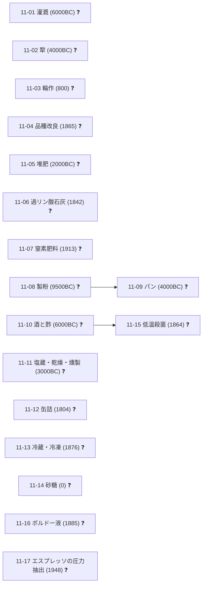
```mermaid
graph LR
  n11_01["11-01 灌漑 (6000BC) ❓"]
  n11_02["11-02 犂 (4000BC) ❓"]
  n11_03["11-03 輪作 (800) ❓"]
  n11_04["11-04 品種改良 (1865) ❓"]
  n11_05["11-05 堆肥 (2000BC) ❓"]
  n11_06["11-06 過リン酸石灰 (1842) ❓"]
  n11_07["11-07 窒素肥料 (1913) ❓"]
  n11_08["11-08 製粉 (9500BC) ❓"]
  n11_09["11-09 パン (4000BC) ❓"]
  n11_10["11-10 酒と酢 (6000BC) ❓"]
  n11_11["11-11 塩蔵・乾燥・燻製 (3000BC) ❓"]
  n11_12["11-12 缶詰 (1804) ❓"]
  n11_13["11-13 冷蔵・冷凍 (1876) ❓"]
  n11_14["11-14 砂糖 (0) ❓"]
  n11_15["11-15 低温殺菌 (1864) ❓"]
  n11_16["11-16 ボルドー液 (1885) ❓"]
  n11_17["11-17 エスプレッソの圧力抽出 (1948) ❓"]
  n11_08-->n11_09
  n11_10-->n11_15
```

### 幹12 建築・土木

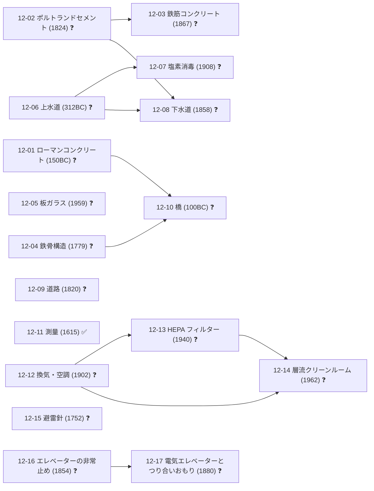
```mermaid
graph LR
  n12_01["12-01 ローマンコンクリート (150BC) ❓"]
  n12_02["12-02 ポルトランドセメント (1824) ❓"]
  n12_03["12-03 鉄筋コンクリート (1867) ❓"]
  n12_04["12-04 鉄骨構造 (1779) ❓"]
  n12_05["12-05 板ガラス (1959) ❓"]
  n12_06["12-06 上水道 (312BC) ❓"]
  n12_07["12-07 塩素消毒 (1908) ❓"]
  n12_08["12-08 下水道 (1858) ❓"]
  n12_09["12-09 道路 (1820) ❓"]
  n12_10["12-10 橋 (100BC) ❓"]
  n12_11["12-11 測量 (1615) ✅"]
  n12_12["12-12 換気・空調 (1902) ❓"]
  n12_13["12-13 HEPA フィルター (1940) ❓"]
  n12_14["12-14 層流クリーンルーム (1962) ❓"]
  n12_15["12-15 避雷針 (1752) ❓"]
  n12_16["12-16 エレベーターの非常止め (1854) ❓"]
  n12_17["12-17 電気エレベーターとつり合いおもり (1880) ❓"]
  n12_02-->n12_03
  n12_06-->n12_07
  n12_02-->n12_08
  n12_06-->n12_08
  n12_01-->n12_10
  n12_04-->n12_10
  n12_12-->n12_13
  n12_12-->n12_14
  n12_13-->n12_14
  n12_16-->n12_17
```

### 幹13 医薬・衛生

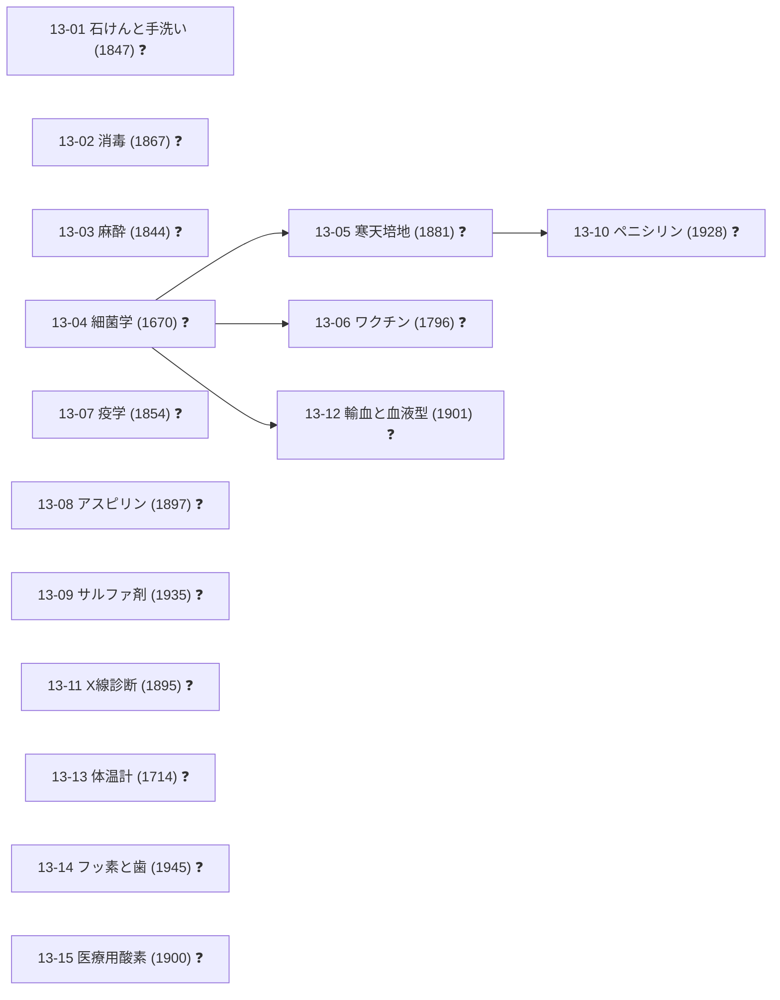
```mermaid
graph LR
  n13_01["13-01 石けんと手洗い (1847) ❓"]
  n13_02["13-02 消毒 (1867) ❓"]
  n13_03["13-03 麻酔 (1844) ❓"]
  n13_04["13-04 細菌学 (1670) ❓"]
  n13_05["13-05 寒天培地 (1881) ❓"]
  n13_06["13-06 ワクチン (1796) ❓"]
  n13_07["13-07 疫学 (1854) ❓"]
  n13_08["13-08 アスピリン (1897) ❓"]
  n13_09["13-09 サルファ剤 (1935) ❓"]
  n13_10["13-10 ペニシリン (1928) ❓"]
  n13_11["13-11 X線診断 (1895) ❓"]
  n13_12["13-12 輸血と血液型 (1901) ❓"]
  n13_13["13-13 体温計 (1714) ❓"]
  n13_14["13-14 フッ素と歯 (1945) ❓"]
  n13_15["13-15 医療用酸素 (1900) ❓"]
  n13_04-->n13_05
  n13_04-->n13_06
  n13_05-->n13_10
  n13_04-->n13_12
```

### 幹14 輸送

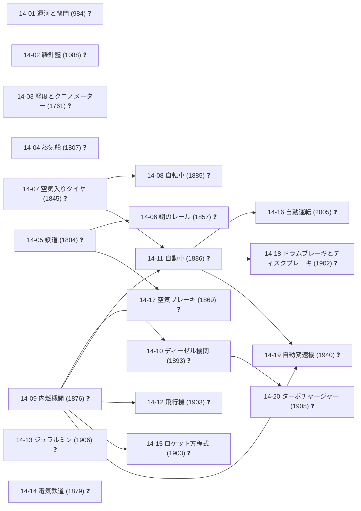
```mermaid
graph LR
  n14_01["14-01 運河と閘門 (984) ❓"]
  n14_02["14-02 羅針盤 (1088) ❓"]
  n14_03["14-03 経度とクロノメーター (1761) ❓"]
  n14_04["14-04 蒸気船 (1807) ❓"]
  n14_05["14-05 鉄道 (1804) ❓"]
  n14_06["14-06 鋼のレール (1857) ❓"]
  n14_07["14-07 空気入りタイヤ (1845) ❓"]
  n14_08["14-08 自転車 (1885) ❓"]
  n14_09["14-09 内燃機関 (1876) ❓"]
  n14_10["14-10 ディーゼル機関 (1893) ❓"]
  n14_11["14-11 自動車 (1886) ❓"]
  n14_12["14-12 飛行機 (1903) ❓"]
  n14_13["14-13 ジュラルミン (1906) ❓"]
  n14_14["14-14 電気鉄道 (1879) ❓"]
  n14_15["14-15 ロケット方程式 (1903) ❓"]
  n14_16["14-16 自動運転 (2005) ❓"]
  n14_17["14-17 空気ブレーキ (1869) ❓"]
  n14_18["14-18 ドラムブレーキとディスクブレーキ (1902) ❓"]
  n14_19["14-19 自動変速機 (1940) ❓"]
  n14_20["14-20 ターボチャージャー (1905) ❓"]
  n14_05-->n14_06
  n14_07-->n14_08
  n14_09-->n14_10
  n14_07-->n14_11
  n14_09-->n14_11
  n14_09-->n14_12
  n14_09-->n14_15
  n14_11-->n14_16
  n14_05-->n14_17
  n14_11-->n14_18
  n14_09-->n14_19
  n14_11-->n14_19
  n14_10-->n14_20
```

### 幹15 通信・情報

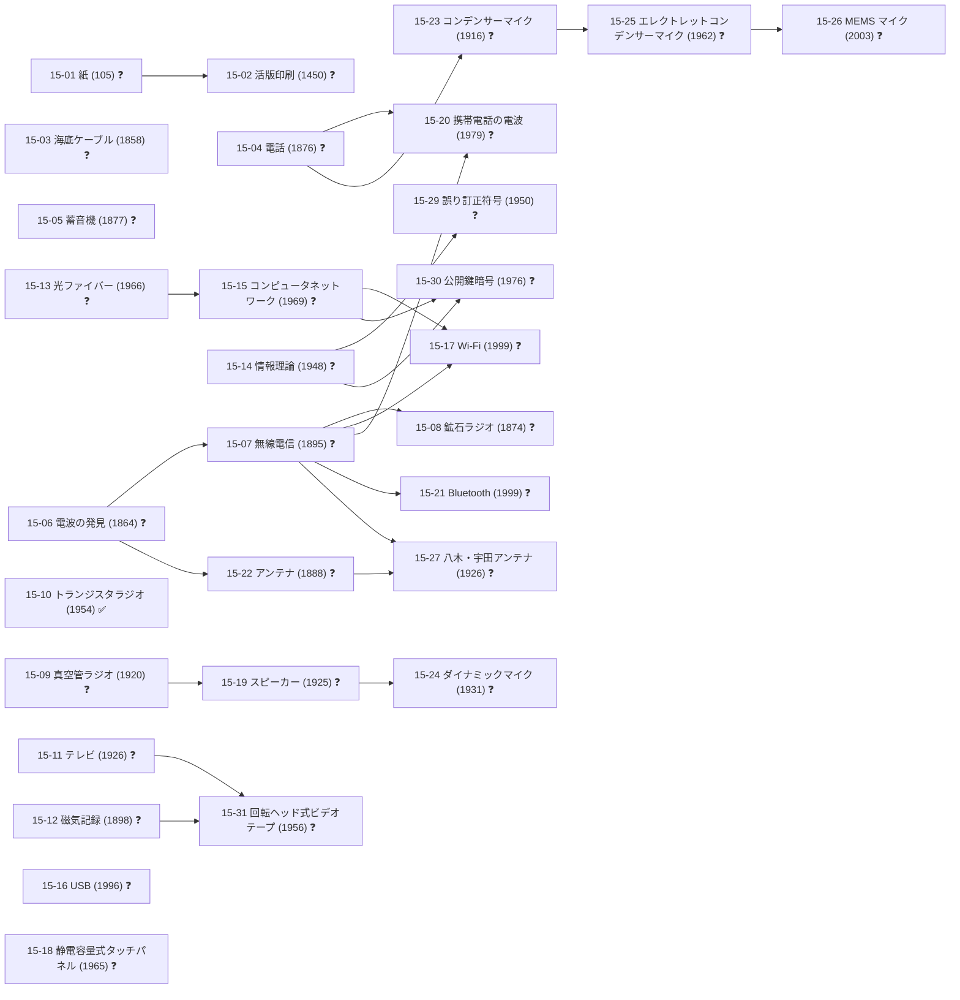
```mermaid
graph LR
  n15_01["15-01 紙 (105) ❓"]
  n15_02["15-02 活版印刷 (1450) ❓"]
  n15_03["15-03 海底ケーブル (1858) ❓"]
  n15_04["15-04 電話 (1876) ❓"]
  n15_05["15-05 蓄音機 (1877) ❓"]
  n15_06["15-06 電波の発見 (1864) ❓"]
  n15_07["15-07 無線電信 (1895) ❓"]
  n15_08["15-08 鉱石ラジオ (1874) ❓"]
  n15_09["15-09 真空管ラジオ (1920) ❓"]
  n15_10["15-10 トランジスタラジオ (1954) ✅"]
  n15_11["15-11 テレビ (1926) ❓"]
  n15_12["15-12 磁気記録 (1898) ❓"]
  n15_13["15-13 光ファイバー (1966) ❓"]
  n15_14["15-14 情報理論 (1948) ❓"]
  n15_15["15-15 コンピュータネットワーク (1969) ❓"]
  n15_16["15-16 USB (1996) ❓"]
  n15_17["15-17 Wi-Fi (1999) ❓"]
  n15_18["15-18 静電容量式タッチパネル (1965) ❓"]
  n15_19["15-19 スピーカー (1925) ❓"]
  n15_20["15-20 携帯電話の電波 (1979) ❓"]
  n15_21["15-21 Bluetooth (1999) ❓"]
  n15_22["15-22 アンテナ (1888) ❓"]
  n15_23["15-23 コンデンサーマイク (1916) ❓"]
  n15_24["15-24 ダイナミックマイク (1931) ❓"]
  n15_25["15-25 エレクトレットコンデンサーマイク (1962) ❓"]
  n15_26["15-26 MEMS マイク (2003) ❓"]
  n15_27["15-27 八木・宇田アンテナ (1926) ❓"]
  n15_29["15-29 誤り訂正符号 (1950) ❓"]
  n15_30["15-30 公開鍵暗号 (1976) ❓"]
  n15_31["15-31 回転ヘッド式ビデオテープ (1956) ❓"]
  n15_01-->n15_02
  n15_06-->n15_07
  n15_07-->n15_08
  n15_13-->n15_15
  n15_07-->n15_17
  n15_15-->n15_17
  n15_09-->n15_19
  n15_04-->n15_20
  n15_07-->n15_20
  n15_07-->n15_21
  n15_06-->n15_22
  n15_04-->n15_23
  n15_19-->n15_24
  n15_23-->n15_25
  n15_25-->n15_26
  n15_07-->n15_27
  n15_22-->n15_27
  n15_14-->n15_29
  n15_14-->n15_30
  n15_15-->n15_30
  n15_11-->n15_31
  n15_12-->n15_31
```

### 幹B 枝

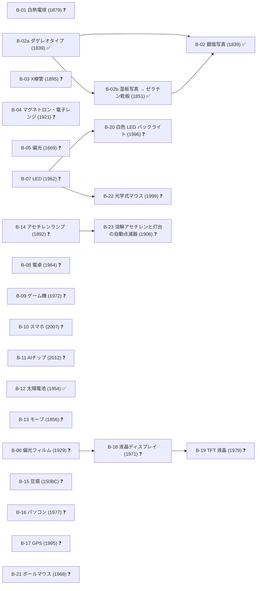
```mermaid
graph LR
  nB_01["B-01 白熱電球 (1879) ❓"]
  nB_02["B-02 銀塩写真 (1839) ✅"]
  nB_02a["B-02a ダゲレオタイプ (1839) ✅"]
  nB_02b["B-02b 湿板写真 → ゼラチン乾板 (1851) ✅"]
  nB_03["B-03 X線管 (1895) ❓"]
  nB_04["B-04 マグネトロン・電子レンジ (1921) ❓"]
  nB_05["B-05 偏光 (1669) ❓"]
  nB_06["B-06 偏光フィルム (1929) ❓"]
  nB_07["B-07 LED (1962) ❓"]
  nB_08["B-08 電卓 (1964) ❓"]
  nB_09["B-09 ゲーム機 (1972) ❓"]
  nB_10["B-10 スマホ (2007) ❓"]
  nB_11["B-11 AIチップ (2012) ❓"]
  nB_12["B-12 太陽電池 (1954) ✅"]
  nB_13["B-13 モーブ (1856) ❓"]
  nB_14["B-14 アセチレンランプ (1892) ❓"]
  nB_15["B-15 豆腐 (150BC) ❓"]
  nB_16["B-16 パソコン (1977) ❓"]
  nB_17["B-17 GPS (1995) ❓"]
  nB_18["B-18 液晶ディスプレイ (1971) ❓"]
  nB_19["B-19 TFT 液晶 (1979) ❓"]
  nB_20["B-20 白色 LED バックライト (1996) ❓"]
  nB_21["B-21 ボールマウス (1968) ❓"]
  nB_22["B-22 光学式マウス (1999) ❓"]
  nB_23["B-23 溶解アセチレンと灯台の自動点滅器 (1906) ❓"]
  nB_02a-->nB_02
  nB_02b-->nB_02
  nB_02a-->nB_02b
  nB_06-->nB_18
  nB_18-->nB_19
  nB_07-->nB_20
  nB_07-->nB_22
  nB_14-->nB_23
```

## 4. 年表マトリクス（本物の欄の最初の年。年なしは除外）

| 幹 | 〜BC | 1〜1500 | 1500〜1800 | 1800〜1900 | 1900〜1950 | 1950〜 |
|---|---|---|---|---|---|---|
| 0 生存・道具 | 0-01 0-02 0-03 0-04 0-05 0-06 0-07 0-08 0-09 0-10 0-11 0-12 0-13 0-14 0-15 0-16 0-17 0-18 0-19 |  |  |  |  |  |
| 1 冶金 | 1-02 1-03 1-05 1-06 1-08 1-09 1-22 1-27 1-30 1-32 1-43 1-45 1-46 1-47 | 1-13 1-58 | 1-10 1-11 1-18 1-20 1-21 1-23 1-31 1-37 1-40 1-51 1-59 | 1-04 1-07 1-12 1-14 1-15 1-24 1-25 1-26 1-29 1-33 1-36 1-38 1-42 1-44 1-49 1-52 1-54 1-56 1-60 1-61 1-63 1-64 1-65 1-73 | 1-01 1-19 1-28 1-34 1-39 1-41 1-50 1-53 1-62 1-66 1-67 1-68 1-69 1-70 1-71 1-74 | 1-16 1-17 1-35 1-48 1-55 1-57 1-72 1-75 1-76 |
| 2 化学 | 2-02 2-03 2-09 2-14 | 2-16 2-22 2-43 | 2-04 2-05 2-07 2-10 2-11 2-20 2-23 2-36 | 2-01 2-06 2-08 2-12 2-13 2-15 2-19 2-21 2-24 2-25 2-26 2-27 2-29 2-31 2-35 2-39 2-42 2-44 | 2-17 2-28 2-32 2-37 2-38 2-40 2-41 2-48 2-49 2-51 2-52 2-53 2-56 2-57 | 2-18 2-30 2-33 2-45 2-46 2-47 2-50 2-54 2-55 |
| 3 熱 | 3-01 3-02 3-04 3-20 |  | 3-05 3-06 3-07 | 3-08 3-09 3-10 3-12 3-13 3-15 3-18 3-19 3-22 3-23 | 3-11 3-14 3-16 3-24 | 3-21 |
| 4 動力・電気 |  |  | 4-02 4-13 | 4-01 4-03 4-04 4-05 4-06 4-07 4-08 4-10 4-12 4-14 4-16 4-18 4-22 4-23 4-25 4-27 4-28 4-30 4-33 | 4-09 4-11 4-17 4-29 | 4-15 4-19 4-20 4-21 4-24 4-26 4-31 4-32 |
| 5 真空 |  |  | 5-01 5-03 | 5-10 5-11 5-12 5-15 5-16 | 5-02 5-04 5-05 5-06 5-14 | 5-07 5-08 5-09 |
| 6 ガス | 6-04 | 6-11 6-16 | 6-01 6-10 6-12 | 6-02 6-03 6-05 6-06 6-07 6-08 6-13 6-14 | 6-09 6-15 |  |
| 7 光学 |  |  | 7-01 7-03 7-04 7-05 7-06 | 7-02 7-07 7-09 | 7-10 7-15 7-22 7-26 | 7-11 7-12 7-13 7-14 7-16 7-17 7-18 7-19 7-20 7-21 7-23 7-24 7-25 |
| 8 精密・計測 | 8-19 |  | 8-01 8-02 8-04 8-10 8-21 8-22 8-42 | 8-03 8-05 8-06 8-12 8-20 8-23 8-26 8-29 8-31 8-32 8-39 | 8-07 8-08 8-11 8-14 8-15 8-18 8-28 8-30 8-33 8-36 8-37 8-40 | 8-09 8-13 8-16 8-17 8-24 8-25 8-27 8-34 8-35 8-38 8-41 |
| 9 半導体プロセス |  |  |  |  | 9-03 9-05 9-07 9-44 9-47 | 9-01 9-02 9-04 9-06 9-08 9-09 9-10 9-11 9-12 9-13 9-14 9-15 9-16 9-17 9-18 9-19 9-20 9-21 9-22 9-23 9-24 9-25 9-26 9-27 9-28 9-29 9-30 9-31 9-32 9-33 9-34 9-35 9-36 9-37 9-38 9-39 9-40 9-41 9-42 9-43 9-45 9-46 9-48 9-49 |
| 10 制御・計算 |  |  | 10-04 10-21 | 10-01 10-02 10-03 10-05 10-20 | 10-06 10-07 10-08 10-27 10-31 | 10-09 10-10 10-11 10-12 10-13 10-14 10-15 10-16 10-17 10-18 10-19 10-22 10-23 10-24 10-25 10-26 10-28 10-29 10-30 10-32 10-33 10-34 10-35 10-36 10-37 |
| 11 農業・食 | 11-01 11-02 11-05 11-08 11-09 11-10 11-11 11-14 | 11-03 |  | 11-04 11-06 11-12 11-13 11-15 11-16 | 11-07 11-17 |  |
| 12 建築・土木 | 12-01 12-06 12-10 |  | 12-04 12-11 12-15 | 12-02 12-03 12-08 12-09 12-16 12-17 | 12-07 12-12 12-13 | 12-05 12-14 |
| 13 医薬・衛生 |  |  | 13-04 13-06 13-13 | 13-01 13-02 13-03 13-05 13-07 13-08 13-11 13-15 | 13-09 13-10 13-12 13-14 |  |
| 14 輸送 |  | 14-01 14-02 | 14-03 | 14-04 14-05 14-06 14-07 14-08 14-09 14-10 14-11 14-14 14-17 | 14-12 14-13 14-15 14-18 14-19 14-20 | 14-16 |
| 15 通信・情報 |  | 15-01 15-02 |  | 15-03 15-04 15-05 15-06 15-07 15-08 15-12 15-22 | 15-09 15-11 15-14 15-19 15-23 15-24 15-27 15-29 | 15-10 15-13 15-15 15-16 15-17 15-18 15-20 15-21 15-25 15-26 15-28 15-30 15-31 |
| B 枝 | B-15 |  | B-05 | B-01 B-02 B-02a B-02b B-03 B-13 B-14 | B-04 B-06 B-23 | B-07 B-08 B-09 B-10 B-11 B-12 B-16 B-17 B-18 B-19 B-20 B-21 B-22 |

## 5. AI までの残り ToDo（[10-16] の祖先のうち未完成、トポロジカル順）

92 / 221 ノードが未完成

1. [1-04] 銅の製錬 ❓
2. [1-13] 亜鉛 ❓
3. [1-23] 輝水鉛鉱 MoS2 ❓
4. [1-25] モナザイト ❓
5. [1-37] ニッケル ❓
6. [1-43] アンチモン ❓
7. [2-43] ばん油 ❓
8. [2-44] 赤リン ❓
9. [3-01] たき火 ❓
10. [3-19] 副産物回収式コークス炉 ❓
11. [2-30] ネガ型フォトレジスト ❓
12. [4-10] 変圧器 ❓
13. [4-13] ボルタ電池 ❓
14. [1-31] モリブデン製錬 ❓
15. [1-70] ジルコニウム・ハフニウム ❓
16. [1-72] 粉末冶金と熱間静水圧プレス ❓
17. [2-05] ルブラン法 ❓
18. [2-15] ホウケイ酸ガラス ❓
19. [1-19] 希土類分離 ❓
20. [1-35] ネオジム磁石 ❓
21. [6-08] 希ガス精製 ❓
22. [6-09] ハーバー・ボッシュ法 ❓
23. [2-06] ソルベー法 ❓
24. [2-07] 重クロム酸カリウム ❓
25. [2-08] 苛性ソーダ ❓
26. [5-12] 真空シール ❓
27. [6-10] 硝石床 ❓
28. [6-12] 鉛室法硫酸 ❓
29. [1-40] クロム ❓
30. [2-38] PTFE ❓
31. [6-14] フッ素ガス ❓
32. [1-39] マグネシウム ❓
33. [1-36] 単体ホウ素 ❓
34. [1-41] チタン ❓
35. [5-06] 油拡散ポンプ ❓
36. [5-16] ゲッター ❓
37. [3-16] 真空炉 ❓
38. [7-14] CO2 レーザー ❓
39. [7-20] エキシマレーザー ❓
40. [2-33] 化学増幅レジスト ❓
41. [7-21] 超低膨張ガラス ❓
42. [8-15] 水晶振動子 ❓
43. [8-31] 研削盤 ❓
44. [8-20] 玉軸受 ❓
45. [5-07] ターボ分子ポンプ ❓
46. [7-17] 多層膜ミラー ❓
47. [8-08] ボールねじ精密ステージ ❓
48. [9-05] Geダイオード ❓
49. [4-11] 整流器 ❓
50. [8-11] 電子顕微鏡 ❓
51. [8-13] 液滴発生器 ❓
52. [7-18] EUV 光源 ❓
53. [9-11] ドーパント源 🔧
54. [9-26] スパッタリング ❓
55. [9-27] ドライエッチング ❓
56. [9-30] エピタキシーと CVD ❓
57. [10-01] 電磁石 ❓
58. [8-33] 質量分析 ❓
59. [9-47] 加速器 ❓
60. [9-28] イオン注入 ❓
61. [10-02] リレー ❓
62. [10-04] フィードバック制御 ❓
63. [10-05] ブール代数とスイッチ回路 ❓
64. [10-09] トランジスタ論理 ❓
65. [11-10] 酒と酢 ❓
66. [11-13] 冷蔵・冷凍 ❓
67. [8-06] 光波干渉測長 ❓
68. [8-17] アライメント ❓
69. [12-12] 換気・空調 ❓
70. [12-13] HEPA フィルター ❓
71. [12-14] 層流クリーンルーム ❓
72. [15-01] 紙 ❓
73. [2-18] 超純水 ❓
74. [7-16] 液浸光学 ❓
75. [9-14] RCA 洗浄 ❓
76. [7-12] クロムマスク ❓
77. [9-23] MOSFET ❓
78. [9-24] CMOS ❓
79. [9-37] FinFET ❓
80. [9-38] GAA ❓
81. [10-10] IC 論理 ❓
82. [10-11] 加算器・カウンタ・レジスタ ❓
83. [10-12] DRAM ❓
84. [10-13] マイクロプロセッサ ❓
85. [10-14] マイクロコンピュータ ❓
86. [10-15] 露光装置の制御 ❓
87. [8-09] リニアモーター・エアベアリングステージ ❓
88. [9-39] 縮小投影露光 ❓
89. [9-40] EUV 露光装置 ❓
90. [10-32] 浮動小数点の標準 ❓
91. [B-11] AIチップ ❓
92. [10-16] ニューラルネット ❓

## 6. 自動検査

- 未定義の前提ID: 0 
- 循環: 0 
- ノード0個の幹: なし
- 重複定義: なし
- 背骨 [0-01]→[10-16]: つながっている
- 「年:」の項目: 514 / 515（⚠️ 81）。項目なし: 7-10

### 年の逆転（ノードの年が、必ず要る前提の年より古い：87 件。直さずに報告だけ）

| ノード | 年 | 前提（いちばん新しい） | 前提の年 | 差 |
|---|---|---|---|---|
| [0-19] ろくろ | -4500 | [0-07] 羊毛と紡錘車 | -4000 | 500 |
| [2-13] 石灰サイクルと塩化カルシウム | 1808 | [2-06] ソルベー法 | 1861 | 53 |
| [1-36] 単体ホウ素 | 1892 | [1-39] マグネシウム | 1941 | 49 |
| [8-12] 刻線機 | 1882 | [8-07] 除振と恒温 | 1931 | 49 |
| [10-03] 電信 | 1837 | [4-03] 銅ケーブル | 1882 | 45 |
| [1-42] リチウム | 1817 | [2-06] ソルベー法 | 1861 | 44 |
| [2-12] 硫酸塩 | 1838 | [4-03] 銅ケーブル | 1882 | 44 |
| [B-13] モーブ | 1856 | [6-06] 塩酸 | 1900 | 44 |
| [4-16] アーク灯 | 1808 | [1-07] 黒鉛 | 1850 | 42 |
| [7-04] 屈折望遠鏡と色消しレンズ | 1608 | [7-03] レンズ研磨 | 1650 | 42 |
| [2-05] ルブラン法 | 1791 | [2-01] 硫酸 | 1831 | 40 |
| [14-03] 経度とクロノメーター | 1761 | [8-02] ねじ切りと互換性部品 | 1797 | 36 |
| [B-01] 白熱電球 | 1879 | [5-05] 水銀拡散ポンプ | 1915 | 36 |
| [14-13] ジュラルミン | 1906 | [1-39] マグネシウム | 1941 | 35 |
| [15-12] 磁気記録 | 1898 | [2-37] ポリエチレン | 1933 | 35 |
| [2-07] 重クロム酸カリウム | 1797 | [2-01] 硫酸 | 1831 | 34 |
| [2-31] 光で固まる膜：アスファルトと重クロム酸ゼラチン | 1826 | [2-35] 原油と蒸留 | 1859 | 33 |
| [7-15] 紫外光学材料 | 1920 | [1-16] トリクロロシラン合成・蒸留 | 1953 | 33 |
| [7-09] 干渉計 | 1881 | [5-14] 真空蒸着 | 1912 | 31 |
| [B-01] 白熱電球 | 1879 | [1-28] タングステン線 | 1910 | 31 |
| [5-10] 真空計 | 1874 | [5-02] 真空管 | 1904 | 30 |
| [3-18] 蓄熱式炉＝設備 | 1856 | [3-19] 副産物回収式コークス炉 | 1881 | 25 |
| [8-16] 走査プローブ顕微鏡 | 1981 | [8-13] 液滴発生器 | 2006 | 25 |
| [7-03] レンズ研磨 | 1650 | [7-01] 光学ガラス | 1674 | 24 |
| [1-33] ホウ素 | 1808 | [2-01] 硫酸 | 1831 | 23 |
| [13-02] 消毒 | 1867 | [6-05] クロルアルカリ電解 | 1890 | 23 |
| [15-08] 鉱石ラジオ | 1874 | [15-07] 無線電信 | 1895 | 21 |
| [10-16] ニューラルネット | 1998 | [9-40] EUV 露光装置 | 2019 | 21 |
| [7-09] 干渉計 | 1881 | [7-10] 水銀ランプ | 1901 | 20 |
| [B-03] X線管 | 1895 | [5-05] 水銀拡散ポンプ | 1915 | 20 |
| [1-31] モリブデン製錬 | 1781 | [6-01] 電解槽 | 1800 | 19 |
| [15-06] 電波の発見 | 1864 | [4-03] 銅ケーブル | 1882 | 18 |
| [1-44] ガリウム | 1871 | [1-14] バイヤー法 | 1888 | 17 |
| [12-11] 測量 | 1615 | [8-04] ノギスとマイクロメータ | 1631 | 16 |
| [B-03] X線管 | 1895 | [1-28] タングステン線 | 1910 | 15 |
| [1-42] リチウム | 1817 | [2-01] 硫酸 | 1831 | 14 |
| [2-11] 硫化水素と硫黄回収 | 1777 | [2-05] ルブラン法 | 1791 | 14 |
| [8-12] 刻線機 | 1882 | [8-05] ゲージブロック | 1896 | 14 |
| [9-35] テスト | 1960 | [10-14] マイクロコンピュータ | 1974 | 14 |
| [2-19] 過酸化水素 | 1818 | [2-01] 硫酸 | 1831 | 13 |
| [13-03] 麻酔 | 1844 | [2-39] エタノール | 1857 | 13 |
| [14-10] ディーゼル機関 | 1893 | [5-04] 油回転ポンプ | 1905 | 12 |
| [B-02] 銀塩写真 | 1839 | [B-02b] 湿板写真 → ゼラチン乾板 | 1851 | 12 |
| [5-02] 真空管 | 1904 | [5-05] 水銀拡散ポンプ | 1915 | 11 |
| [7-03] レンズ研磨 | 1650 | [2-23] 木材乾留 | 1661 | 11 |
| [10-17] CAD | 1963 | [10-14] マイクロコンピュータ | 1974 | 11 |
| [9-05] Geダイオード | 1940 | [9-07] Ge 単結晶の引き上げ | 1950 | 10 |
| [B-11] AIチップ | 2012 | [9-38] GAA | 2022 | 10 |
| [3-11] 光高温計 | 1901 | [1-28] タングステン線 | 1910 | 9 |
| [8-06] 光波干渉測長 | 1892 | [7-10] 水銀ランプ | 1901 | 9 |
| [10-04] フィードバック制御 | 1788 | [8-01] 旋盤 | 1797 | 9 |
| [5-10] 真空計 | 1874 | [4-03] 銅ケーブル | 1882 | 8 |
| [7-06] プリズム分光 | 1666 | [7-01] 光学ガラス | 1674 | 8 |
| [15-08] 鉱石ラジオ | 1874 | [4-03] 銅ケーブル | 1882 | 8 |
| [9-37] FinFET | 1999 | [7-16] 液浸光学 | 2006 | 7 |
| [B-03] X線管 | 1895 | [4-11] 整流器 | 1902 | 7 |
| [B-11] AIチップ | 2012 | [9-40] EUV 露光装置 | 2019 | 7 |
| [5-02] 真空管 | 1904 | [1-28] タングステン線 | 1910 | 6 |
| [9-23] MOSFET | 1959 | [9-14] RCA 洗浄 | 1965 | 6 |
| [B-09] ゲーム機 | 1972 | [9-39] 縮小投影露光 | 1978 | 6 |
| [9-03] 点接触トランジスタ | 1947 | [9-02] ゾーンレベリング | 1952 | 5 |
| [9-08] CZ 法 | 1951 | [1-17] シーメンス法 | 1956 | 5（説明ずみ Y-1） |
| [9-14] RCA 洗浄 | 1965 | [2-18] 超純水 | 1970 | 5 |
| [9-19] レジスト塗布 | 1960 | [9-14] RCA 洗浄 | 1965 | 5 |
| [9-20] 密着・近接露光 | 1955 | [9-19] レジスト塗布 | 1960 | 5 |
| [9-20] 密着・近接露光 | 1955 | [7-11] 銀塩フォトマスク | 1960 | 5 |
| [9-20] 密着・近接露光 | 1955 | [8-17] アライメント | 1960 | 5 |
| [15-15] コンピュータネットワーク | 1969 | [10-14] マイクロコンピュータ | 1974 | 5 |
| [1-29] アルミニウム | 1886 | [6-05] クロルアルカリ電解 | 1890 | 4 |
| [1-38] 氷晶石の合成 | 1886 | [6-05] クロルアルカリ電解 | 1890 | 4 |
| [8-06] 光波干渉測長 | 1892 | [8-05] ゲージブロック | 1896 | 4 |
| [9-08] CZ 法 | 1951 | [9-11] ドーパント源 | 1955 | 4（説明ずみ Y-1） |
| [9-09] FZ 法 | 1952 | [1-17] シーメンス法 | 1956 | 4（説明ずみ Y-1） |
| [9-10] 成長接合トランジスタ | 1951 | [9-11] ドーパント源 | 1955 | 4 |
| [11-13] 冷蔵・冷凍 | 1876 | [6-03] 圧縮機 | 1880 | 4 |
| [5-14] 真空蒸着 | 1912 | [5-05] 水銀拡散ポンプ | 1915 | 3 |
| [9-33] ワイヤーボンディング | 1957 | [9-32] ダイシング | 1960 | 3 |
| [4-11] 整流器 | 1902 | [5-02] 真空管 | 1904 | 2 |
| [1-14] バイヤー法 | 1888 | [6-05] クロルアルカリ電解 | 1890 | 2 |
| [1-38] 氷晶石の合成 | 1886 | [1-14] バイヤー法 | 1888 | 2 |
| [9-07] Ge 単結晶の引き上げ | 1950 | [9-01] Ge 帯域精製 | 1952 | 2 |
| [1-41] チタン | 1940 | [1-39] マグネシウム | 1941 | 1 |
| [9-16] 熱拡散 | 1954 | [9-11] ドーパント源 | 1955 | 1 |
| [9-18] プレーナ技術 | 1959 | [9-19] レジスト塗布 | 1960 | 1 |
| [9-22] 集積回路 | 1958 | [9-18] プレーナ技術 | 1959 | 1 |
| [9-22] 集積回路 | 1958 | [9-25] 金属配線 | 1959 | 1 |
| [9-28] イオン注入 | 1954 | [9-11] ドーパント源 | 1955 | 1 |
